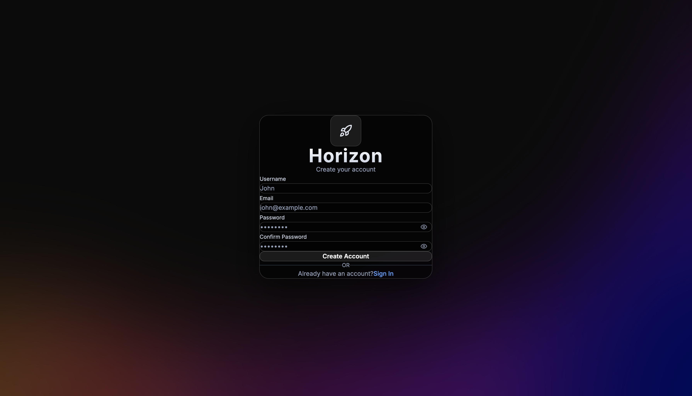
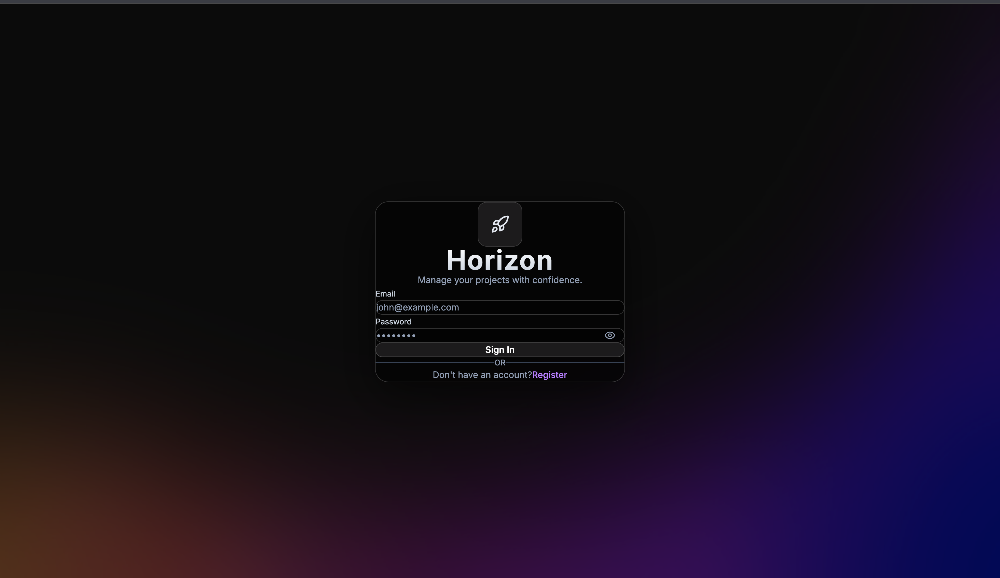
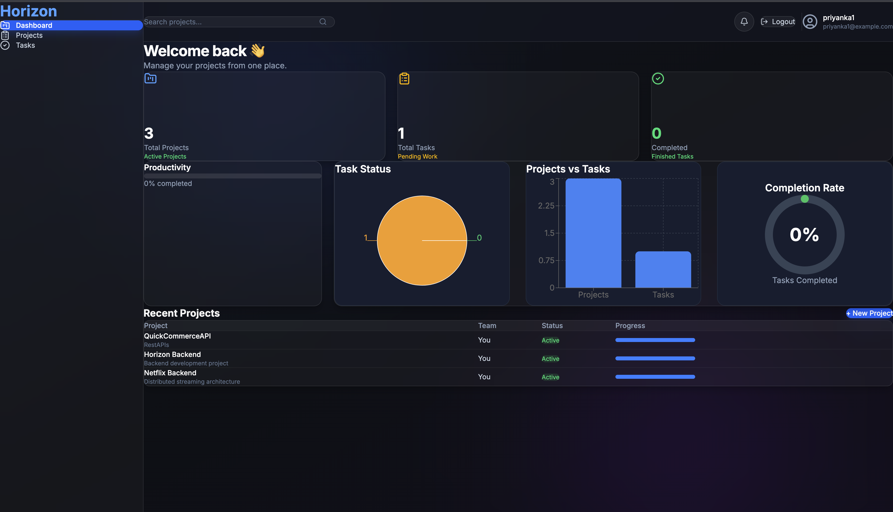
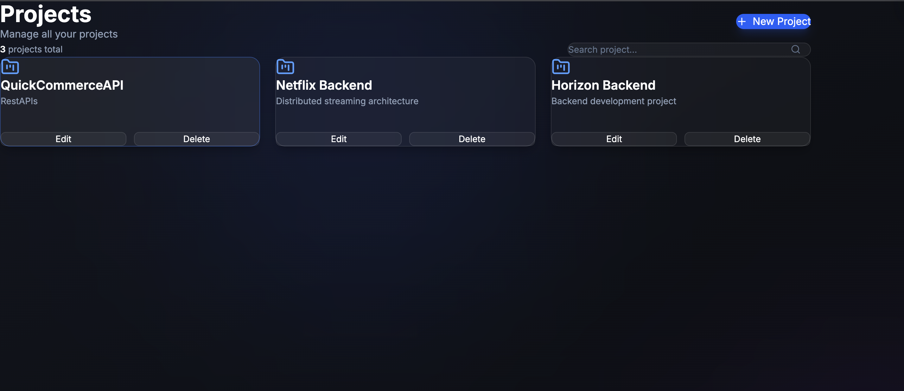
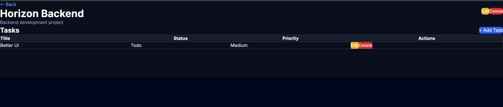
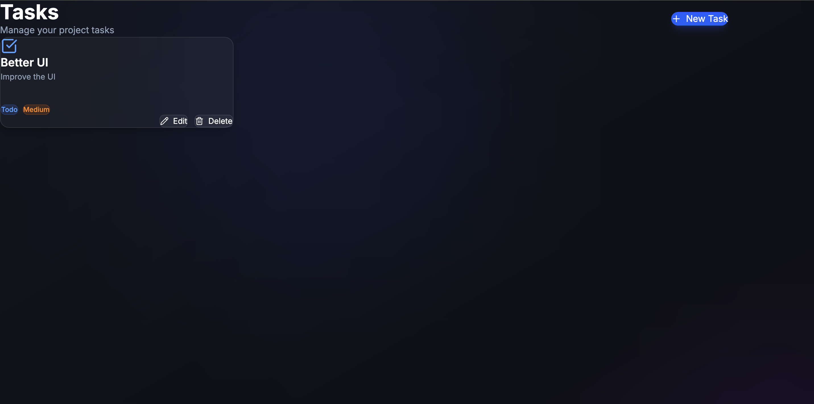
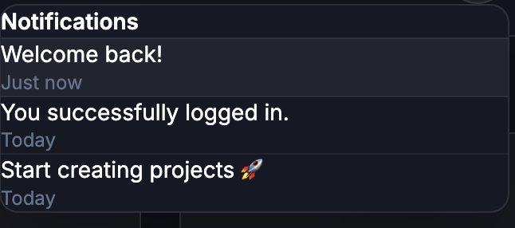

<div align="center">

# 🚀 Horizon

### Modern Project Management Platform

Built with **FastAPI • React • TypeScript • PostgreSQL • Tailwind CSS**

Manage Projects • Track Tasks • Monitor Progress • Stay Organized

---


</div>

---

# 📖 About

Horizon is a full-stack project management application that helps users efficiently organize projects and tasks through a clean, responsive interface. The application includes secure authentication, project management, task tracking, notifications, and a real-time dashboard for monitoring productivity.

---

# ✨ Features

## 🔐 Authentication

- User Registration
- Secure Login
- JWT Authentication
- Protected Routes
- Logout

---

## 📊 Dashboard

- Project Statistics
- Task Statistics
- Completed Tasks
- Recent Projects
- User Profile
- Search Projects
- Notifications

---

## 📁 Projects

- Create Project
- Edit Project
- Delete Project
- View Project Details
- Search Projects

---

## ✅ Tasks

- Create Tasks
- Edit Tasks
- Delete Tasks
- Update Status
- Set Priority
- View Tasks by Project

---

## 🎨 User Interface

- Responsive Design
- Modern Dashboard
- Dark Theme
- Interactive Modals
- Clean Navigation

---

# 🏗 Architecture

```text
                     Horizon

        React + TypeScript Frontend
                   │
              Axios REST API
                   │
         FastAPI Backend Server
                   │
      JWT Authentication Layer
                   │
      SQLAlchemy ORM + Pydantic
                   │
             PostgreSQL Database
```

---

# 🛠 Tech Stack

### Frontend

- React
- TypeScript
- Tailwind CSS
- Axios
- React Router
- Lucide React
- Vite

### Backend

- FastAPI
- SQLAlchemy
- PostgreSQL
- JWT Authentication
- Alembic
- Pydantic

---

# 📂 Folder Structure

```text
Horizon
│
├── backend
│   ├── app
│   │   ├── api
│   │   ├── core
│   │   ├── db
│   │   ├── dependencies
│   │   ├── models
│   │   ├── routes
│   │   ├── schemas
│   │   ├── services
│   │   └── main.py
│   │
│   └── requirements.txt
│
├── frontend
│   ├── src
│   │   ├── api
│   │   ├── components
│   │   ├── context
│   │   ├── pages
│   │   ├── services
│   │   └── App.tsx
│   │
│   └── package.json
│
├── screenshots
└── README.md
```

---

# 📸 Application Screenshots

## Registration



---

## 🔑 Login



---

## 📊 Dashboard



---

## 📁 Projects



---

## 📄 Project Details



---

## ✅ Tasks



---

## 🔔 Notifications



---

# ⚙ Installation

## Clone Repository

```bash
git clone https://github.com/Priyanka16060/Horizon.git
cd Horizon
```

---

## Backend

```bash
cd backend

python -m venv venv
```

### macOS/Linux

```bash
source venv/bin/activate
```

### Windows

```bash
venv\Scripts\activate
```

Install dependencies

```bash
pip install -r requirements.txt
```

Run server

```bash
uvicorn app.main:app --reload
```

---

## Frontend

```bash
cd frontend

npm install

npm run dev
```

---

# 🌐 API Endpoints

### Authentication

- POST `/auth/register`
- POST `/auth/login`
- GET `/auth/me`

### Dashboard

- GET `/dashboard`

### Projects

- GET `/projects`
- POST `/projects`
- PUT `/projects/{id}`
- DELETE `/projects/{id}`

### Tasks

- GET `/tasks`
- POST `/tasks`
- PUT `/tasks/{id}`
- DELETE `/tasks/{id}`

---

# 🚀 Future Improvements

- Team Collaboration
- File Attachments
- Drag & Drop Kanban Board
- Calendar Integration
- Real-time Updates
- Email Notifications
- Charts & Analytics

---

# 📚 Learning Outcomes

- REST API Development
- JWT Authentication
- CRUD Operations
- SQLAlchemy ORM
- PostgreSQL Integration
- React with TypeScript
- FastAPI Backend Development
- State Management
- Responsive UI Design
- API Integration with Axios

---

# 👩‍💻 Author

**Priyanka**

Computer Science Engineering Student

GitHub: **https://github.com/Priyanka16060**

---

<div align="center">

⭐ If you like this project, consider giving it a star!

</div>
